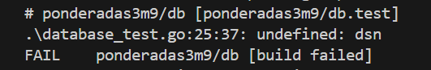
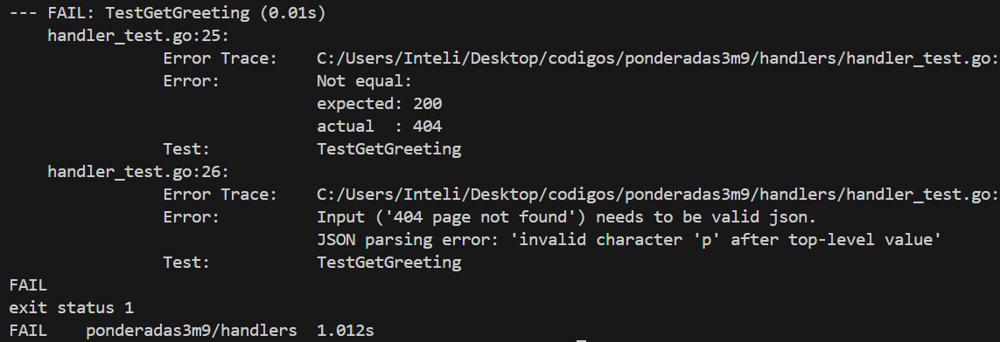
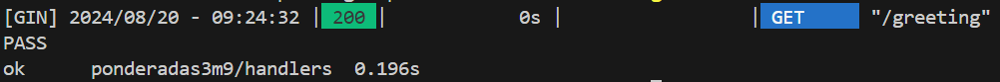
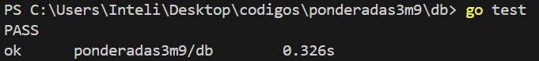

# TDD em GoLang com GIN

## Testes em Go

Em Go, os testes são uma parte crucial do desenvolvimento de software de alta qualidade. A linguagem suporta testes automatizados diretamente com sua ferramenta de teste embutida, que permite aos desenvolvedores escrever, executar e verificar testes com facilidade. Para organizar os testes, geralmente criamos arquivos de teste com o sufixo `_test.go`.

## Desenvolvimento Orientado a Testes (TDD)

O Desenvolvimento Orientado a Testes (TDD, do inglês Test-Driven Development) é uma metodologia de desenvolvimento de software que coloca os testes no centro do processo de criação do código. Em vez de escrever o código primeiro e, posteriormente, testar, o TDD inverte essa ordem: os testes são escritos antes do código funcional, guiando o desenvolvimento e garantindo que cada funcionalidade seja validada de forma eficaz desde o início. Possui 3 etapas:

1. **Red (Vermelho)**: Escrever um teste que falhe inicialmente, pois a funcionalidade ainda não foi implementada.
2. **Green (Verde)**: Escrever o código mínimo necessário para fazer o teste passar.
3. **Refactor (Refatorar)**: Melhorar o código garantindo que os testes continuem passando.

## Aplicação do TDD em Go

Aplicar TDD em Go envolve criar funções de teste que verificam se o código atende aos requisitos especificados. Vamos passar pelo ciclo TDD (Red, Green, Refactor) para criar e testar uma função de conexão ao banco de dados usando Gorm e um handler HTTP simples usando Gin.

### Red: Escrever testes que falhem

Primeiro, escrevemos os testes que esperamos que falhem, pois as funções ainda não foram completamente implementadas.

**Teste para o handler HTTP `GetGreeting`:**

```go
package handlers

import (
	"net/http"
	"net/http/httptest"
	"testing"

	"github.com/gin-gonic/gin"
	"github.com/stretchr/testify/assert"
)

func TestGetGreeting(t *testing.T) {
	// Setup
	gin.SetMode(gin.TestMode)
	router := gin.Default()
	router.GET("/greeting", GetGreeting)

	// Execute request
	req, _ := http.NewRequest("GET", "/greeting", nil)
	w := httptest.NewRecorder()
	router.ServeHTTP(w, req)

	// Assert
	assert.Equal(t, http.StatusOK, w.Code)
	assert.JSONEq(t, `{"message": "Hello, World!"}`, w.Body.String())

}
```


Quando rodamos esse teste, ele falhará por não ter sua implementação ou por estar incompleta






### Green: Código necessário para o teste funcionar

Agora escrevemos o código que passará nos testes

```go


func GetGreeting(c *gin.Context) {
	c.JSON(http.StatusOK, gin.H{"message": "Hello, World!"})
}

func ConnectDatabase(dsn string) (*gorm.DB, error) {
	db, err := gorm.Open(postgres.Open(dsn), &gorm.Config{})
	if err != nil {
		return nil, err
	}
	return db, nil
}

```


Com esse código conseguiremos passar nos testes






### Refactor: Melhorar o código mantendo os testes passando
Com os testes passando, podemos refatorar o código se necessário. Por exemplo, poderíamos melhorar a configuração do banco de dados ou a estrutura dos handlers para maior clareza e manutenção. No entanto, no exemplo atual, o código já está relativamente simples e claro.

## Conclusão
Seguindo o ciclo TDD (Red, Green, Refactor), garantimos que cada nova funcionalidade é bem testada e que o código é continuamente melhorado para manter a qualidade e legibilidade. 

Além disso, carrega muitos beneficios como:

**Qualidade do Código:** O TDD força os desenvolvedores a pensar nos requisitos e na funcionalidade antes de escrever o código, o que resulta em um código mais claro e bem estruturado.

**Confiança na Evolução do Sistema:** Com um conjunto robusto de testes automatizados, os desenvolvedores podem refatorar e evoluir o sistema com confiança, sabendo que os testes vão detectar possíveis regressões.

**Menos Bugs:** Como os testes são escritos antes do código, os bugs são detectados mais cedo no ciclo de desenvolvimento, reduzindo o custo de correção e aumentando a confiabilidade do software.


